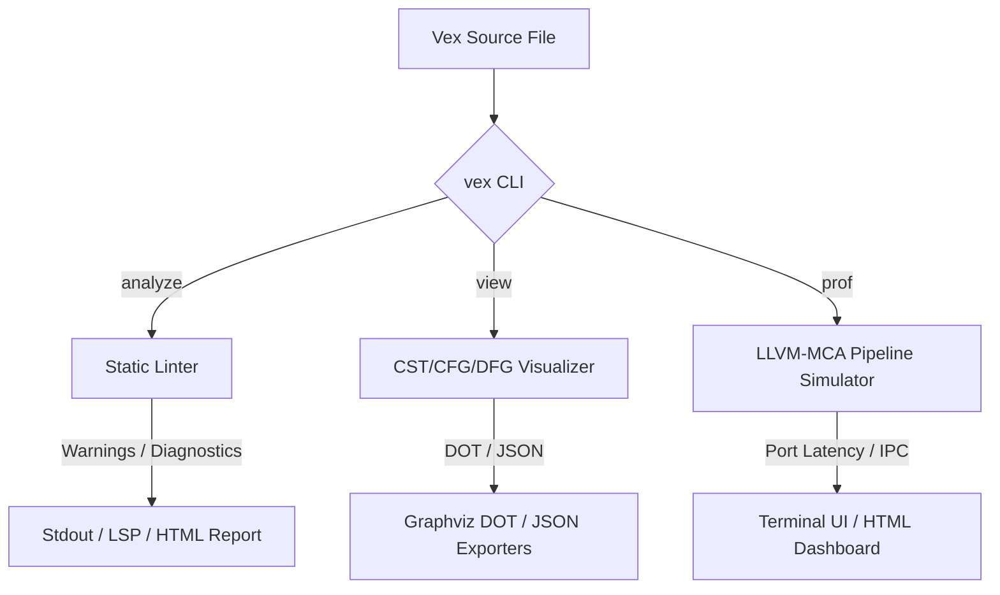

# VAPE: Vex Analyzer, Profiler & Visualizer Ecosystem

VAPE is a first-class static analysis and performance profiling ecosystem built directly into the Vex compiler. Unlike other languages where safety auditing, microarchitectural pipeline profiling, and compilation state visualization require complex third-party setups, Vex integrates these components natively under a single command interface.

---

## 🏛️ Architecture & Integration

VAPE operates as an end-to-end telemetry pipeline inside the Vex compiler CLI, hooking directly into the AST parsing, HIR lowering, and LLVM CodeGen phases.



---

## 🔍 1. Static Linter (`vex analyze`)

The Vex linter runs as a post-lowering compiler pass over the High-Level Intermediate Representation (HIR) and parsed syntax trees. It guarantees code safety and hygiene before binary compilation.

### CLI Usage
```bash
# Analyze a Vex file and output formatted terminal diagnostics
vex analyze main.vx

# Output diagnostics in raw JSON format for IDE/LSP integrations
vex analyze main.vx --format=json
```

### Active Lint Rules

#### Rule `W0002`: Unused Imports
*   **Description:** Warns on imports that are declared in the module header but never referenced in statements.
*   **Wildcards:** Correctly detects unused wildcard imports (e.g. `import * as alias from "module"`).
*   **Help Option:** Helps keep dependencies clean, reducing compilation times.

#### Rule `W0010`: Unsafe FFI Boundary Safety
*   **Description:** Audits external FFI functions (`extern "C"`). Emits warnings if FFI calls are not guarded by the Vex inline rescue operator `!>`.
*   **Why:** FFI calls can trigger external crashes. Guarding them with rescue blocks (`ffi_call() !> { recovery_block }`) ensures program resilience.

#### Rule `W0011`: Redundant Literal Clones
*   **Description:** Highlights calls to `.clone()` or `.copy()` on literals (e.g. `100.clone()`).
*   **Help Option:** Literals are copy-by-value, making duplicate allocation calls redundant.

---

## 📊 2. Intermediate State Visualizer (`vex view`)

`vex view` allows developers to inspect intermediate compiler representations (AST, Control Flow, and SSA Data Flow) to debug performance problems or complex compiler transformations.

### CLI Usage
```bash
# Export the parsed Rowan CST as text layout
vex view ast main.vx

# Export the parsed Rowan CST in structured JSON format
vex view ast main.vx --format=json

# Export the Control Flow Graph (CFG) in Graphviz DOT format
vex view cfg main.vx --output=cfg.dot

# Export the Data Flow Graph (DFG) in Graphviz DOT format
vex view dfg main.vx --output=dfg.dot
```

### Exporters

1.  **Rowan AST Exporter:** Serializes the concrete syntax tree, showing tokens and structural syntax nodes.
2.  **LLVM Control Flow Graph (CFG):** Outputs basic block jump graphs showing branch target locations and instructions. Useful for analyzing branch predictions and execution hotpaths.
3.  **LLVM Data Flow Graph (DFG):** Maps Static Single Assignment (SSA) values and operand dependencies. Allows developers to trace register dependency chains.

---

## ⚡ 3. Microarchitectural Profiler (`vex prof`)

`vex prof` simulates instruction execution cycles on target CPU microarchitectures by compiling Vex source to assembly, injecting LLVM-MCA start/stop markers, and programmatically running the LLVM Machine Code Analyzer.

::: tip Why Vex is Better Than Rust and Go
*   **Rust:** Requires manual generation of assembly files (`cargo rustc -- --emit=asm`), manual injection of `# LLVM-MCA-BEGIN` markers, target machine architecture lookup, and external execution.
*   **Go:** Lacks microarchitectural execution unit profiling.
*   **Vex:** Accomplishes the entire sequence automatically via `vex prof main.vx`.
:::

### CLI Usage
```bash
# Profile the code using the native host CPU architecture
vex prof main.vx

# Profile simulating a specific target processor model (Intel/AMD/Apple Silicon)
vex prof main.vx --cpu=apple-m2
```

### Metrics Highlighted
*   **Total Cycles:** The total execution clock cycles simulated by LLVM-MCA.
*   **IPC (Instructions Per Cycle):** Throughput rating representing hardware pipeline utilization.
*   **Block RThroughput (Reciprocal Throughput):** Estimated cycles required to execute one iteration of a loop block.
*   **Resource Pressure Heatmaps:** Shows pipeline pressure across execution unit ports (e.g. arithmetic vs memory units).
*   **Active Pipeline Stalls:** Detects which hardware stages are limiting dispatch (e.g. Retire Control Unit token starvation, scheduler queue full).
*   **Dependency Bottlenecks:** Details registers/execution units responsible for critical paths (e.g. register dependencies, resource interference).

::: info Cross-Platform Execution
Standard `llvm-mca` assembly parsers crash on macOS due to Darwin-specific assembler directives (like `.subsections_via_symbols`). Vex works around this automatically by filtering out non-instruction dot-directives (preserving local `.L` branch labels) at runtime.
:::

---

## 📈 4. Next Generation: HTML Performance Reports

VAPE is being updated to support `--report=html`. This merges static lints, control flow visualizers, and simulated execution timelines into an interactive, visual dashboard:

*   **Interactive CFG/DFG Graph:** Renders code blocks visually using custom canvas or SVG elements.
*   **Color-Coded Latency:** Highlights hot instructions with cycle density heatmaps.
*   **Inline Tooltips:** Shows execution delays and register hazards directly inside source file views.

---

## 🚀 5. Advanced Analyzer Roadmap (Future Plans)

To push VAPE beyond standard tooling available in Go and Rust, the following advanced features are planned for future development:

### 1. Memory Layout & Cache-Line Visualizer
*   **Goal:** Visually map how struct fields are laid out in memory, identifying padding waste and cache-line boundaries.
*   **Benefit:** Enables developers to reorder struct fields to fit perfectly within L1 cache lines (e.g., 64 bytes) without relying on external macros or guesswork.

### 2. Auto-Remediation & Quick-Fixes
*   **Goal:** Provide automated, semantic code refactoring directly from the CLI (`vex fix`) or via LSP code actions.
*   **Benefit:** Not just identifying redundant `.clone()` calls or borrowing issues, but actually writing the correct borrow-semantics fix directly into the source file.

### 3. Escape Analysis Visualizer
*   **Goal:** Map variables that escape to the heap (allocations) directly onto the Data Flow Graph.
*   **Benefit:** Turns raw escape analysis text (like Go's `-m`) into an intuitive graph, showing exactly *which* function call forced a variable onto the heap.

### 4. SIMD & Vectorization Predictor
*   **Goal:** Statically analyze loops and provide human-readable feedback on why a loop cannot be vectorized.
*   **Benefit:** Explicitly highlights loop-carried dependencies, guiding developers on how to restructure code for SIMD acceleration.

### 5. Non-Contiguous Memory Access Warning
*   **Goal:** Detect sub-optimal array/matrix traversals (e.g., column-major reads on row-major data).
*   **Benefit:** Prevents massive performance drops caused by cache-thrashing, a common pitfall in performance-critical applications.

### 6. Branch Predictability & PGO Hints
*   **Goal:** Analyze `if/else` control flow graphs to predict branch-predictor friendliness.
*   **Benefit:** Suggests replacing highly unpredictable branches with branchless alternatives (e.g., lookup tables or conditional moves) for better pipeline throughput.
