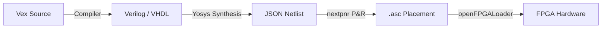

# VexHDL Transpiler, Synthesis, and Integration Guide

This guide details VexHDL's interoperability with Verilog and VHDL, external module imports, simulator bypass rules, synthesis pipeline, and timing verification.

---

## 1. Foreign Language Interface (`extern`)

VexHDL allows you to import existing Verilog or VHDL modules directly into your project. This is useful for reusing legacy IP (like memory controllers or clock managers).

### 1.1 Importing Verilog Modules
Use `extern "verilog"` block pointing to the source file:
```vexhdl
extern "verilog" from "ip_cores/fifo_mem.v" {
    // Declarations match Verilog module ports and parameters
    module fifo_mem #(
        DATA_WIDTH: U32 = 8,
        ADDR_WIDTH: U32 = 4,
    )(
        clk: Input,
        wr_en: Input,
        rd_en: Input,
        data_in: Input[DATA_WIDTH],
        data_out: Output[DATA_WIDTH],
        full: Output,
        empty: Output,
    );
}
```

### 1.2 Importing VHDL Entities
Use `extern "vhdl"` block:
```vexhdl
extern "vhdl" from "ip_cores/sp_ram.vhd" {
    module sp_ram #(
        width: U32 = 16,
        depth: U32 = 256,
    )(
        clk: Input,
        we: Input,
        addr: Input[8],
        di: Input[width],
        do: Output[width],
    );
}
```

---

## 2. Compilation and Simulation Bypass Rules

When your project includes foreign (`extern`) imports, the VexHDL compiler enforces strict rules to guarantee synthesis compatibility:

1. **Single-Language Target Constraint**: You cannot mix `extern "verilog"` and `extern "vhdl"` in the same project. If both are present, the compiler throws `E030: SirUnsynthesizable` error.
2. **Simulation Bypass**:
   * If a project is **100% pure VexHDL**, the built-in simulator (`vex-hdl-sim`) runs immediately and outputs waveform data.
   * If a project imports **extern** modules, `vex-hdl-sim` cannot interpret foreign code and is bypassed. The IDE notifies you and routes the simulation execution to external simulators (such as Vivado XSim, ModelSim, or Verilator) running in the background.

---

## 3. Synthesis and Place & Route Pipeline

VexHDL compiles down to synthesizable Verilog, VHDL, or gate-level BLIF representations. Vex Studio automates the synthesis pipeline:



1. **Frontend Compilation**: Vex compiler lowers `.vxh` source files to AST, checks HIR constraints, and converts to a Simulation & Synthesis IR (SIR).
2. **Yosys Synthesis**: The generated synthesizable Verilog is processed by Yosys to produce a gate-level netlist in JSON format.
3. **nextpnr P&R**: The JSON netlist is mapped onto specific FPGA cells (LUTs, Flip-Flops) by nextpnr, producing physical placement files.
4. **Hardware Flashing**: Physical binaries are uploaded to the board using openFPGALoader.

---

## 4. SDF Timing Verification post-synthesis

Post-synthesis gate-level simulation uses **SDF (Standard Delay Format)** timing annotation:
* **Delay Loading**: Vex simulator loads `.sdf` files containing cell and interconnect delays.
* **Timing Checks**: During simulation, setup/hold constraints on flip-flop inputs are evaluated. If a setup time or hold time violation occurs, the simulator logs timing alerts directly to the console.
